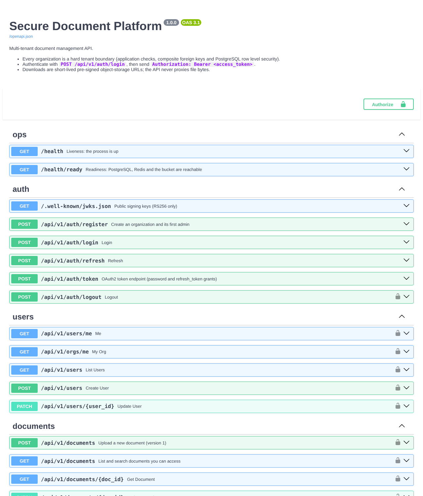
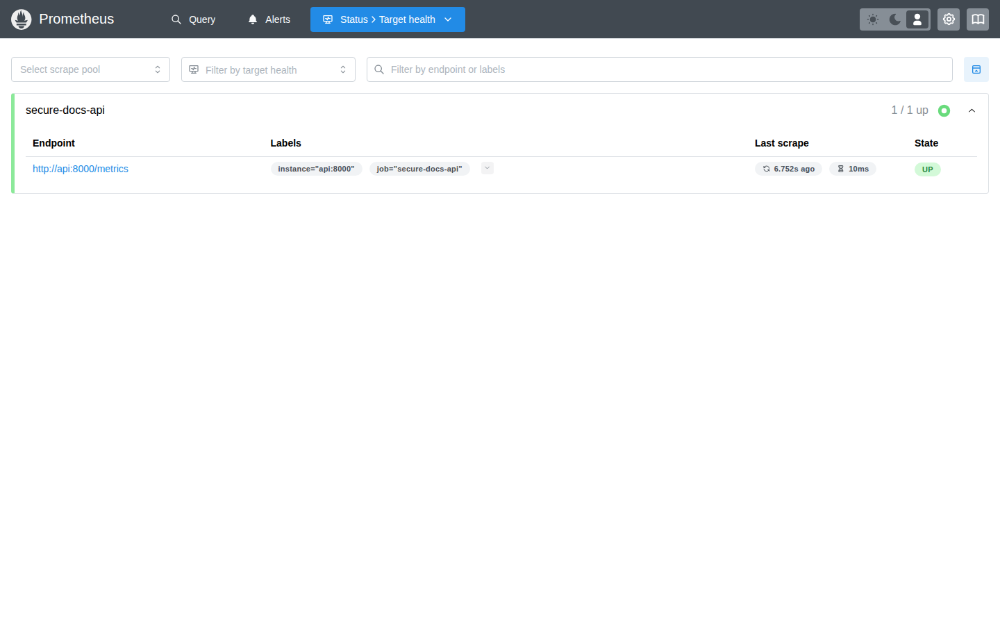
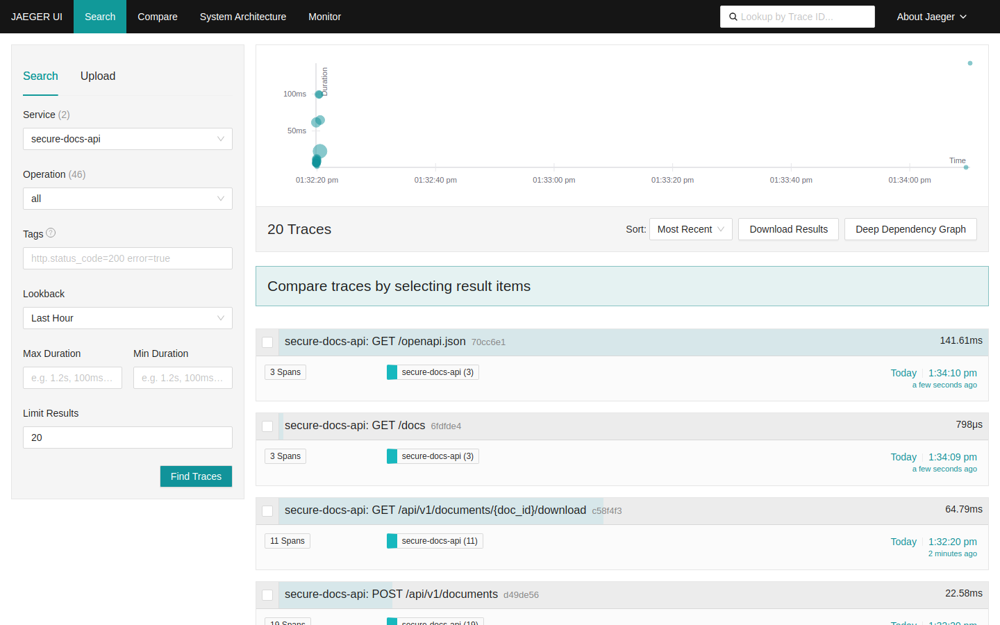
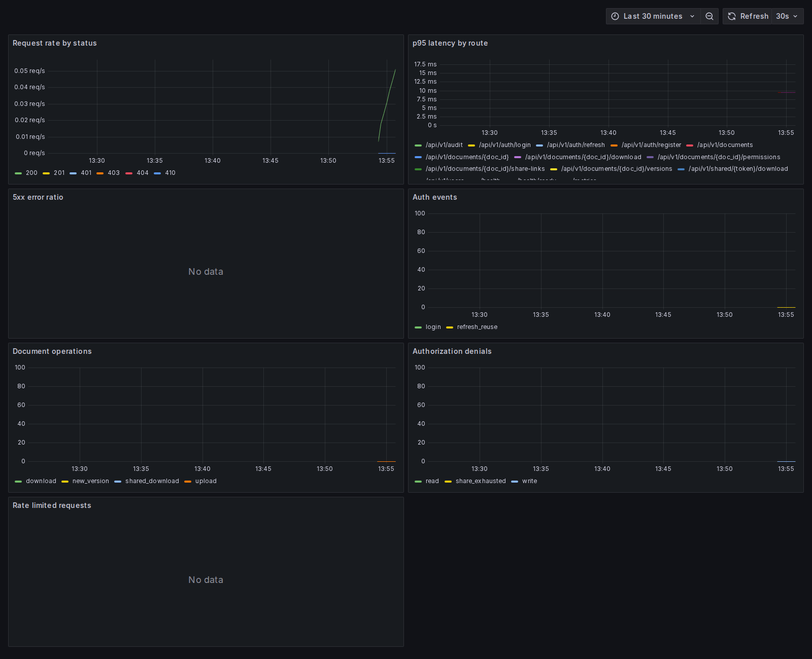
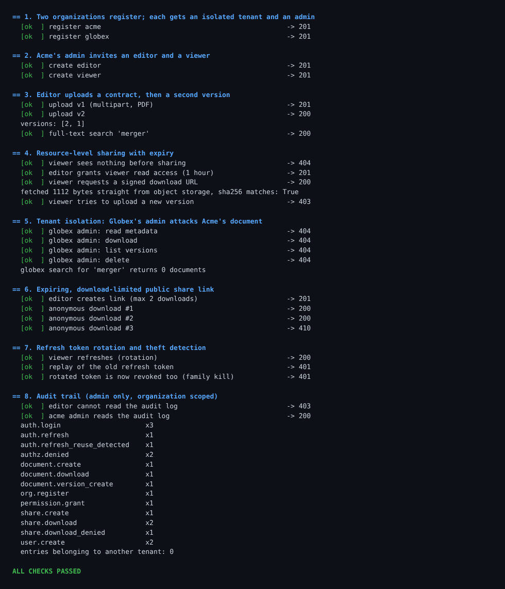
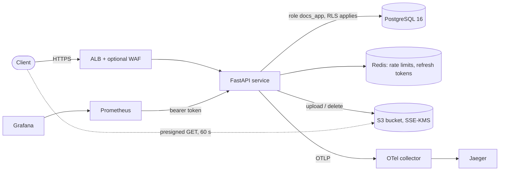

# Secure Document Platform

[](https://github.com/5exclamations/secure-docs-platform/actions/workflows/ci.yml)
[](https://github.com/5exclamations/secure-docs-platform/actions/workflows/security.yml)
[](https://github.com/5exclamations/secure-docs-platform/actions/workflows/infra.yml)

A multi-tenant document management API with security engineering as the main subject: tenant isolation enforced at four layers including PostgreSQL row level security, short-lived signed downloads, expiring sharing, an append-only audit trail, and the infrastructure, pipelines, observability and runbooks around it. The AWS side is reference infrastructure that was validated and policy-scanned, not deployed.

**Stack:** Python 3.12, FastAPI, SQLAlchemy 2 (async), Alembic, PostgreSQL 16, Redis 7, S3-compatible storage, Docker Compose, Terraform (AWS), GitHub Actions, Prometheus, Grafana, OpenTelemetry, Jaeger, pytest.



## What this project demonstrates

| Skill area | Where to look | Evidence |
|---|---|---|
| Backend architecture | [`app/`](app), [architecture](docs/architecture.md) | Async FastAPI service, explicit authorization layer, Alembic migrations, row-locked version allocation, atomic share-link counters, Redis-backed rate limits and refresh rotation |
| Multi-tenant security | [`app/authz.py`](app/authz.py), [`tests/test_tenant_isolation.py`](tests/test_tenant_isolation.py) | Org-scoped queries, 404-for-foreign-ids, composite foreign keys, RLS, token claim cross-check; 13 attack scenarios |
| PostgreSQL row level security | [`migrations/versions/0001_initial_schema.py`](migrations/versions/0001_initial_schema.py), [`app/db.py`](app/db.py) | Transaction-local tenant setting, unprivileged runtime role, startup guard that refuses a role able to bypass RLS, tests that attack the database directly |
| Application security | [security review](docs/security-review.md), [threat model](docs/threat-model.md), [controls matrix](docs/security-controls.md) | JWT hardening, refresh replay detection, upload validation, header and CORS policy, log/trace scrubbing, documented limits |
| AWS infrastructure as code | [`infra/`](infra), [infrastructure](docs/infrastructure.md), [review](docs/infrastructure-review.md) | Seven Terraform modules, least-privilege IAM, KMS, private data tier, optional WAF; validated, Checkov-clean, boot script executed against stubs in CI |
| Docker and CI/CD | [`Dockerfile`](Dockerfile), [`docker-compose.yml`](docker-compose.yml), [`.github/workflows/`](.github/workflows) | Non-root read-only image, three pipelines, full compose stack started on a runner and exercised end to end |
| Observability | [`deploy/`](deploy), [`app/observability.py`](app/observability.py) | Structured logs, Prometheus metrics and alerts, OpenTelemetry traces, provisioned Grafana dashboard, CI proof that telemetry reaches each backend |
| Automated security testing | [`tests/`](tests), [security workflow](.github/workflows/security.yml) | Cross-tenant, expired-link, forged-token, replay, concurrency and RLS tests plus Bandit, Semgrep, CodeQL, pip-audit, Trivy, gitleaks, Checkov, TFLint |

## Running stack, as captured

Screenshots taken from the Compose stack running on a GitHub Actions runner (Prometheus scraping the API, Jaeger holding real traces, Grafana querying real metrics):

| | |
|---|---|
|  |  |
| Prometheus scraping the API with a bearer token (target UP). | Jaeger holding real traces from the demo traffic, with route-template span names. |



The provisioned Grafana dashboard querying live Prometheus data. The time axis is short because the demo runs for a few seconds; "No data" on the 5xx and rate-limit panels is correct, since neither occurred. These images are produced by `scripts/capture_screenshots.py` in the CI job, which fails if a page does not show its expected content.

## Try it

```bash
make secrets                 # random local secrets into .env (git-ignored)
docker compose up --build -d # API, Postgres, Redis, MinIO, Prometheus, Grafana, Jaeger, OTel collector
python scripts/demo.py --base-url http://localhost:8000
python scripts/verify_observability.py --env-file .env
```

No cloud account is needed. The first build compiles MinIO from source (see [MinIO caveats](docs/infrastructure-review.md#minio-source-build-strategy-for-local-development)). Ports and credentials: [deployment guide](docs/deployment.md).

The demo walkthrough creates two organizations, uploads and versions a document, shares it, proves cross-tenant requests get 404, exercises a download-capped share link, and shows refresh-token theft detection and the audit trail. Output of a real run is in [`docs/demo-output.txt`](docs/demo-output.txt):



## Architecture in one picture



Details, sequence diagrams (auth, upload, download), the data model and the AWS topology: [docs/architecture.md](docs/architecture.md).

## Security design in brief

* **Four-layer tenant isolation**: organization-scoped queries, composite foreign keys, PostgreSQL row level security bound per transaction, and a token claim cross-check. Foreign ids answer 404, indistinguishable from missing ones.
* **Least privilege**: the API connects as a role that is neither owner, superuser nor `BYPASSRLS`, and refuses to start otherwise; the audit table is append-only even for its owner; the EC2 role reaches one bucket, one key, three secrets and one repository; no SSH, IMDSv2 only.
* **Sessions**: refresh tokens are single use; a replay revokes the whole session family and raises an alert.
* **Downloads**: short-lived presigned URLs straight from object storage. An issued URL cannot be revoked and stays valid until it expires (60 s default, 300 s cap); this and other limits are spelled out in the [security review](docs/security-review.md).
* **Uploads**: streamed size cap, type allowlist with magic-byte verification, sanitized names, random object keys, attachment-only downloads.
* **Abuse controls**: Redis rate limits, per-account lockout, trusted-proxy aware client address, fail-closed when Redis is down.
* **Telemetry hygiene**: share-link tokens, credentials and bound SQL values are kept out of logs, metrics and traces, with tests.

## Verification status

Every result below comes from a run on the final commit or is labelled otherwise. Nothing is estimated.

| Check | Result |
|---|---|
| GitHub Actions on the pull request | CI (lint, strict mypy, unit, PostgreSQL and Redis integration, real-MinIO integration, image build and scan, full compose smoke test), Security (Bandit, Semgrep, pip-audit, gitleaks, Trivy, CodeQL) and Infrastructure (Terraform fmt, validate, TFLint, Checkov, boot-script verification): all green |
| Test suite, PostgreSQL 16 + Redis 7 + moto S3 | 112 passed, 1 skipped (the skipped test needs a real S3 server) |
| Test suite against a real MinIO server | 113 passed, including presigned-URL expiry and tampered-signature rejection |
| Coverage of `app/` | 93.4 percent measured locally (CI gate: 80 percent) |
| Compose stack on a GitHub runner | API, PostgreSQL 16, Redis, MinIO, Prometheus, Grafana, OpenTelemetry Collector and Jaeger start; the demo passes against the containers; MinIO enforces presigned-URL expiry; Prometheus has application metrics, Jaeger has traces with no share-link tokens, and a Grafana panel query returns real samples |
| Static analysis | ruff and `mypy --strict` clean; Bandit, Semgrep (python, OWASP, jwt packs) and pip-audit: no findings; gitleaks over the full history: clean; CodeQL (security-extended): no results; Trivy (filesystem, IaC, image): clean, with two intentional IaC findings annotated |
| Terraform | `fmt`, `validate`, TFLint pass; Checkov 258 passed, 0 failed, 17 skips each annotated at the resource; the EC2 boot script is rendered and executed against stubs |

**Not exercised, and not claimed:** nothing was deployed to AWS. Terraform was validated and policy-scanned, never planned or applied, so IAM, IMDS, ECR, KMS grants, WAF and similar AWS behavior is unverified; the specific list is in [docs/infrastructure-review.md](docs/infrastructure-review.md#unverified-aws-specific-behavior). There are no benchmarks or load tests. Local runs used Python 3.13; the Dockerfile and CI use 3.12.

## Engineering Decisions & Interview Talking Points

1. **Why three isolation layers instead of just RLS?** RLS is the safety net, not the primary control: application checks give the right error semantics (404, audit of denials), composite foreign keys make cross-tenant references impossible to even store, and RLS catches the query someone forgets to scope. The honest gap: `users` and `organizations` have no RLS because login must resolve an email before any tenant is known.
2. **Making RLS safe with a connection pool.** The tenant id is set with `set_config(..., true)` (transaction-local) from an `after_begin` hook, so a pooled connection can never carry one request's tenant into the next. The silent failure mode of RLS (owner or `BYPASSRLS` roles skip it) is closed with a startup guard, found during review rather than by a test.
3. **Presigned URLs versus proxying downloads.** Redirecting to object storage keeps large transfers off the API and keeps credentials out of clients, at the cost that issued URLs cannot be revoked. I chose a short TTL with a hard cap and documented the window instead of hiding it.
4. **Concurrency by construction.** Version numbers are allocated under a row lock, download caps are one conditional `UPDATE ... RETURNING`, refresh rotation uses an atomic `GETDEL`. The concurrent-upload test caught a real bug (a stale ORM instance returned the old version number even under `FOR UPDATE`).
5. **Share-link token design.** `{org_id}.{256-bit secret}`: the prefix lets the unauthenticated endpoint bind the right tenant for RLS before any lookup, only a hash is stored, and the token is scrubbed from traces and logs (a leak found by reading the instrumentation output).
6. **Refresh-token theft detection.** Rotation plus family revocation means a stolen token is detected on first reuse. The trade-off, a lost response looks like a replay, is intentional and documented.
7. **What CI and review caught that local tests did not.** A test that re-keyed a shared DB role (broke only with CI's different password), a Trivy action tag that did not resolve, TFLint module constraints, a host-header check that would have failed every ALB health check, a container-unreachable instance metadata hop limit, a missing KMS grant for alarm delivery, and an `awscli` package that does not exist on Amazon Linux 2023. Several of those would only have surfaced during a real deployment.
8. **Cost-aware cloud design.** EC2 behind an ALB with a single NAT keeps the baseline near 100 USD a month; the doc lists what to add for production (second AZ, Multi-AZ RDS, WAF, per-AZ NAT) and what each costs. Choosing not to deploy is explicit: nothing here claims a live environment.
9. **A dependency decision I would revisit.** MinIO stopped maintaining its community edition and is AGPL; it is confined to local development and CI behind localhost, built from a pinned commit, and the code only needs the S3 API, so replacing it is a one-service change.
10. **What I would do next.** Malware scanning on upload, audit log shipping to an object-locked bucket, an external identity provider, RS256 key rotation with overlap, a password change and reset flow, and a second application instance.

## Repository map

```
app/                 FastAPI service (routers, authz, security, storage, middleware, observability)
migrations/          Alembic: explicit DDL, RLS policies, audit trigger, least-privilege grants
tests/               pytest suites; tests/infra.py starts throwaway Postgres, Redis and S3
scripts/             demo, observability verification, screenshots, DB role bootstrap, local stack
deploy/              Prometheus, Grafana, OTel collector, Postgres init, MinIO build
infra/               Terraform modules, dev environment, boot-script verification
docs/                architecture, threat model, controls, reviews, infrastructure, deployment, runbook
.github/workflows/   ci, security, infra pipelines; dependabot
SPEC.md              the original specification this implementation started from
```

## Known limitations

Single application instance in the reference deployment; no malware scanning of uploads; metadata-only search; HS256 shared secret by default (RS256 available); no external identity provider federation, password reset or MFA; issued presigned URLs cannot be revoked before they expire; admin hard delete does not erase object versions immediately on a versioned bucket; MinIO, used only for local development and tests, is unmaintained upstream and AGPL-licensed. Each is explained with its trade-off in the [security review](docs/security-review.md), the [threat model](docs/threat-model.md) and the [infrastructure review](docs/infrastructure-review.md).
