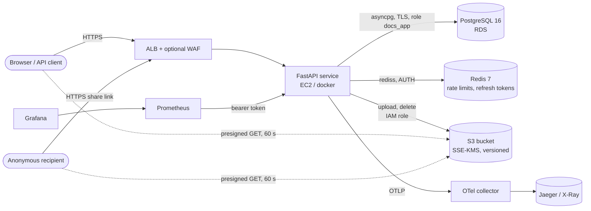
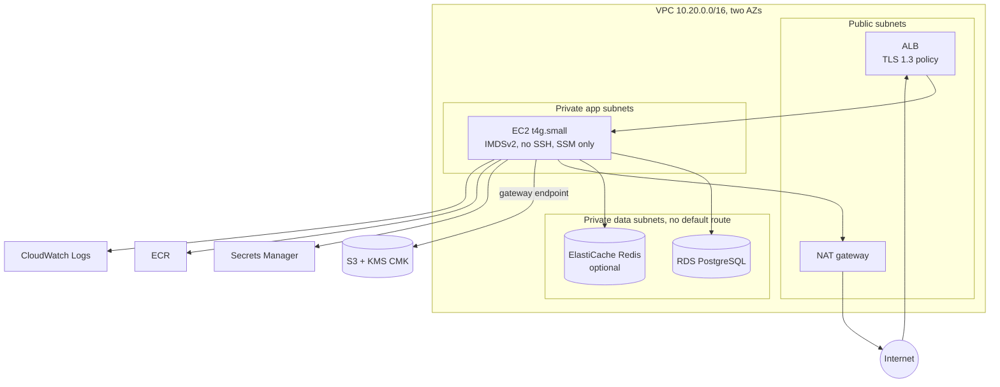
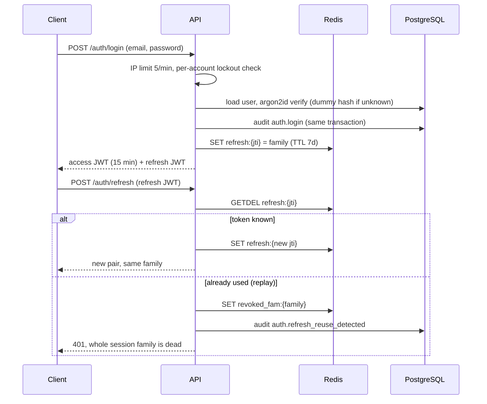
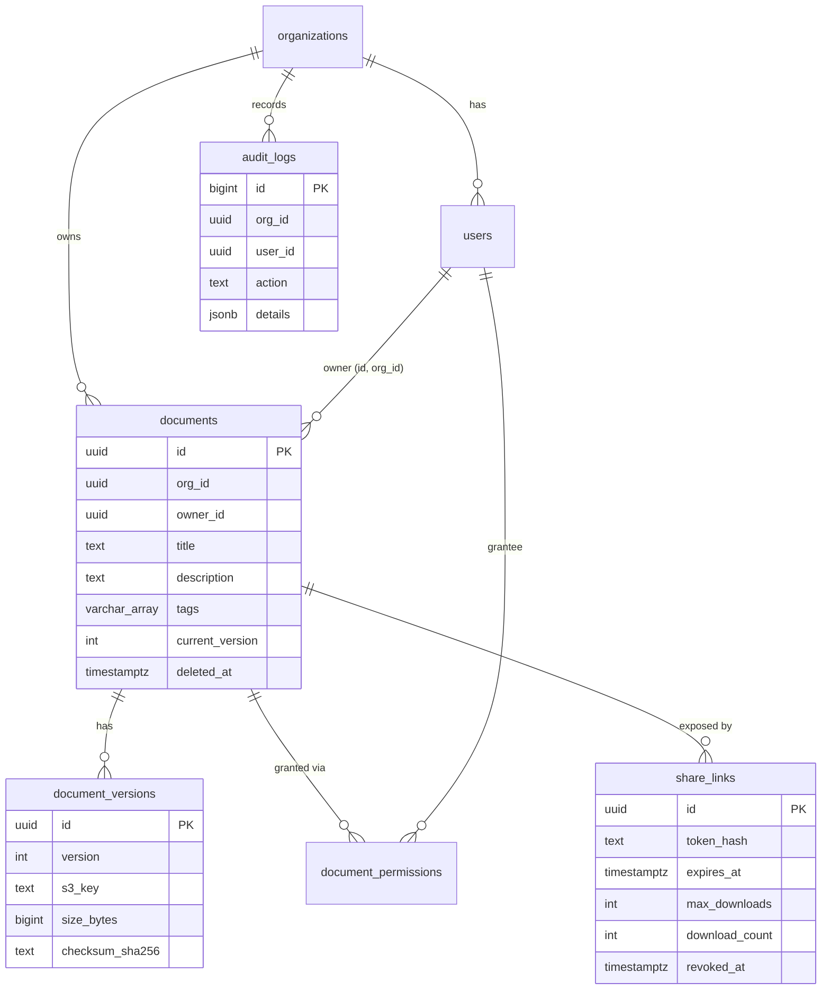

# Architecture

## System context



File bytes never flow through the API on download: the API authorizes, writes an audit row, and returns a presigned URL that the client fetches directly from object storage. Uploads do pass through the API so that size limits, content sniffing and checksums are enforced before anything is stored.

## Local development stack

`docker compose up` starts PostgreSQL, Redis, MinIO (built from source, see `deploy/minio/Dockerfile`), a one-shot migration job, the API, an OpenTelemetry collector with Jaeger, Prometheus and Grafana. Everything binds to `127.0.0.1`. No cloud account is involved.

## AWS reference deployment



Security groups form a chain: internet to ALB (443, 80 redirect), ALB to app (8000), app to RDS (5432) and Redis (6379). Nothing else is open. See [infrastructure.md](infrastructure.md) for resources, costs and accepted risks.

## Tenant isolation, four layers deep

1. **Application**: every query filters on `org_id` taken from the authenticated user, never from the request. Cross-tenant ids answer `404`, identical to a missing id, so identifiers cannot be enumerated.
2. **Schema**: child tables reference `(id, org_id)` pairs through composite foreign keys. A permission, version or share link cannot point at a parent or a user that belongs to a different organization, even for a superuser.
3. **Row level security**: `documents`, `document_versions`, `document_permissions`, `share_links` and `audit_logs` carry a policy `org_id = current_setting('app.org_id')`. The API sets that value with `set_config(..., is_local => true)` at the start of each transaction (a SQLAlchemy `after_begin` hook), so it can never leak across pooled connections. With no tenant bound the policy matches nothing. The runtime role is neither owner, superuser nor `BYPASSRLS`.
4. **Tokens**: the JWT carries `org_id`, and the server rejects a token whose claim differs from the user's stored organization.

## Authentication and sessions



Tokens are HS256 by default. Setting `JWT_ALGORITHM=RS256` signs with an RSA key, publishes `/.well-known/jwks.json` and `/.well-known/openid-configuration`, so another service can verify tokens without a shared secret. The verification algorithm is pinned server-side, so algorithm-confusion and `alg: none` tokens are refused (both are tested).

The service issues its own tokens; it is not an OIDC provider and does not federate to one. Adding an external IdP means validating its ID token in `get_current_user` and mapping the subject to a `users` row; the rest of the authorization path does not change.

## Authorization model

Effective rights on a document are the intersection of the caller's relationship to it and the ceiling of their role.

| Role | Ceiling | Relationship that grants access |
|---|---|---|
| admin | everything in own organization | automatic |
| editor | read, write, delete, share | owner, or an unexpired grant |
| viewer | read | owner, or an unexpired grant |

A `write` grant given to a viewer is capped to read by the role ceiling; demoting an owner immediately removes their write access. Grants carry an optional `expires_at` that is evaluated on every request, in SQL for listings and in Python for single documents.

## Upload and download flows

```mermaid
sequenceDiagram
  participant C as Client
  participant A as API
  participant S as Object store
  participant D as PostgreSQL
  C->>A: POST /documents (multipart)
  A->>A: stream to temp file, count bytes (413 over 50 MB), sha256
  A->>A: type allowlist + magic-byte check, sanitize filename
  A->>S: PUT {org}/{doc}/{random uuid}  (SSE-KMS)
  A->>D: BEGIN; lock document row; version = current + 1; INSERT version; audit; COMMIT
  Note over A,S: if the DB step fails the object is deleted
  C->>A: GET /documents/{id}/download
  A->>D: authorize, audit document.download
  A-->>C: presigned URL (60 s, attachment disposition, stored content type)
  C->>S: GET presigned URL
```

The row lock on the document is what makes concurrent uploads receive distinct, gap-free version numbers (found and fixed through the concurrency test).

## Share links

A share link is `{org_id_hex}.{256-bit random}`. Only the SHA-256 of the token is stored. The organization prefix lets the public endpoint bind the correct tenant for row level security before it looks anything up. Validity checks and the download counter are a single `UPDATE ... WHERE revoked_at IS NULL AND expires_at > now() AND download_count < max_downloads RETURNING`, so a link limited to N downloads yields exactly N under concurrency (25 parallel requests against a limit of 5 produce 5 successes in the test suite).

## Data model



## Observability

| Signal | Implementation |
|---|---|
| Logs | structlog JSON on stdout: request id, user id, organization id, trace id; secrets are redacted by key name |
| Metrics | `/metrics` (bearer-token protected, blocked at the ALB): request count and latency by route template, auth events, document events, authorization denials, rate-limit rejections |
| Traces | OpenTelemetry for FastAPI and SQLAlchemy, exported over OTLP; health and metrics endpoints excluded |
| Health | `/health` (liveness), `/health/ready` (PostgreSQL, Redis, bucket) |
| Alerts | Prometheus rules in `deploy/prometheus/alerts.yml`; CloudWatch alarms in `infra/modules/observability` |
